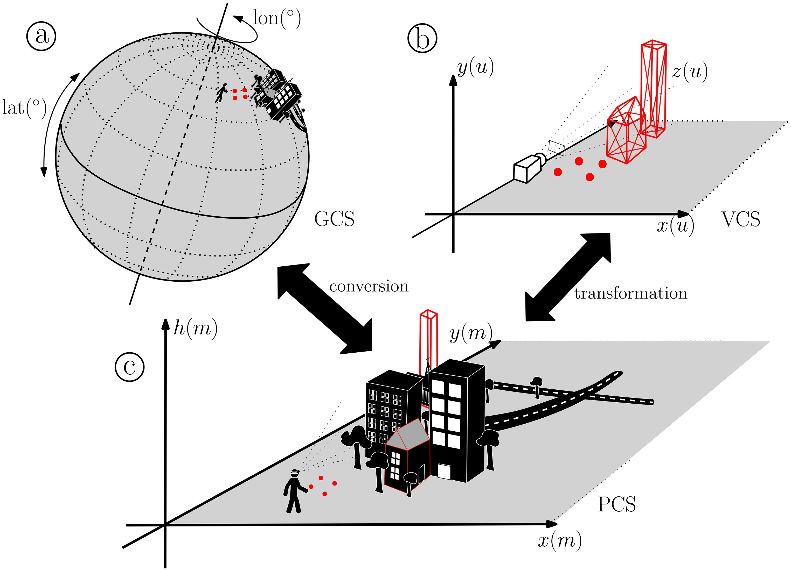

# 🏙️ GeoAR — Geospatially Aware Augmented Reality

A calibration framework for **Geographic-Aware Augmented Reality** — enabling AR devices to
accurately anchor virtual content to real-world geographic coordinates, even for objects
**more than 1 km away**.

<p align="center">
  
</p>

[](https://doi.org/10.1080/13658816.2024.2355326)
[](https://geoinfo.geo.tuwien.ac.at/geoar-getting-started/)
[](https://osf.io/sur6q/overview)
[](https://unity.com/)
[](https://www.microsoft.com/hololens)

---

## 📖 Overview

**GeoAR** is a research framework and calibration method that makes augmented reality
applications **geographically aware**. Instead of relying solely on local spatial anchors,
GeoAR aligns virtual content with real-world geographic coordinates — allowing AR devices
to render digital landmarks, buildings, and points of interest that are hundreds of meters
or even kilometers away.

The framework was developed as part of Ph.D. research at **TU Wien** (Research Group
Geoinformation) and is published in the *International Journal of Geographical
Information Science* (IJGIS).

### ✨ Key Features

- 🌍 **Geographic awareness** — anchors virtual content to real-world coordinates
- 📏 **Long-range AR** — renders objects beyond 1 km distance
- 🎯 **Four calibration approaches** — flexible accuracy vs. setup trade-offs
- 💾 **Spatial Anchor reuse** — save and reload calibrations across sessions
- 🕶️ **HoloLens 2 ready** — reference implementation for Microsoft HoloLens 2
- 🧩 **Adaptable** — code can be ported to other AR devices

---

## 🎥 Demo

<!-- Add a short GIF or video link here -->
> _Demo video coming soon._

---

## 🚀 Getting Started

The full step-by-step tutorial is available here:

👉 **[GeoAR: Getting Started — TU Wien](https://geoinfo.geo.tuwien.ac.at/geoar-getting-started/)**

### Requirements

| Requirement | Version / Notes |
|-------------|-----------------|
| **AR Device** | Microsoft HoloLens 2 |
| **Unity Hub** | with Unity **2021.3.2f1** installed |
| **IDE** | Microsoft Visual Studio |
| **SDK** | Mixed Reality Toolkit (MRTK) Foundation for Unity |

> 💡 If you're new to Unity or MRTK, the tutorial recommends completing the official
> Microsoft training modules first.

### Quick Start

1. **Download** the project from [OSF](https://osf.io/sur6q/overview) and unpack it locally.
2. **Open** the `GeoARUnityProject` folder with Unity Hub (use Unity 2021.3.2f1).
3. **Play** in game mode to explore the application without a device.
4. **Deploy** to HoloLens 2 following the tutorial's deployment section.
5. **Calibrate** using one of the four approaches (see below).

> ⚠️ **Known issue:** If the digital landmarks (white columns) don't appear after loading
> the geo-scene, try removing and re-importing `scene1.xml` into the `Assets/Resource` folder.

---

## 🎯 Calibration Approaches

The framework provides **four calibration methods**, each trading off setup effort against
accuracy:

1. **Location-based calibration** — uses the device's current GPS/position
2. **Dynamic calibration** — continuously refines alignment during use
3. **Fixed-points calibration** — uses known reference points for high accuracy
4. **Spatial Anchors** — saves and reuses a previous calibration across sessions

The tutorial walks through each approach in detail (sections 5–7).

---

## 🛠️ Tech Stack

| Layer | Technology |
|-------|------------|
| **Engine** | Unity 2021.3.2f1 |
| **AR SDK** | Mixed Reality Toolkit (MRTK) Foundation |
| **Device** | Microsoft HoloLens 2 |
| **IDE** | Microsoft Visual Studio |
| **Language** | C# |
| **Geospatial** | Geographic coordinate systems, spatial anchors |

---

## 📄 Publication

If you use this framework in your work, please cite:

```bibtex
@article{galvao2024geoar,
  title   = {GeoAR: a calibration method for Geographic-Aware Augmented Reality},
  author  = {Galv{\~a}o, Marcelo L. and Fogliaroni, Paolo and Giannopoulos, Ioannis
             and Navratil, Gerhard and Kattenbeck, Markus and Alinaghi, Negar},
  journal = {International Journal of Geographical Information Science},
  pages   = {1--27},
  year    = {2024},
  doi     = {10.1080/13658816.2024.2355326}
}
